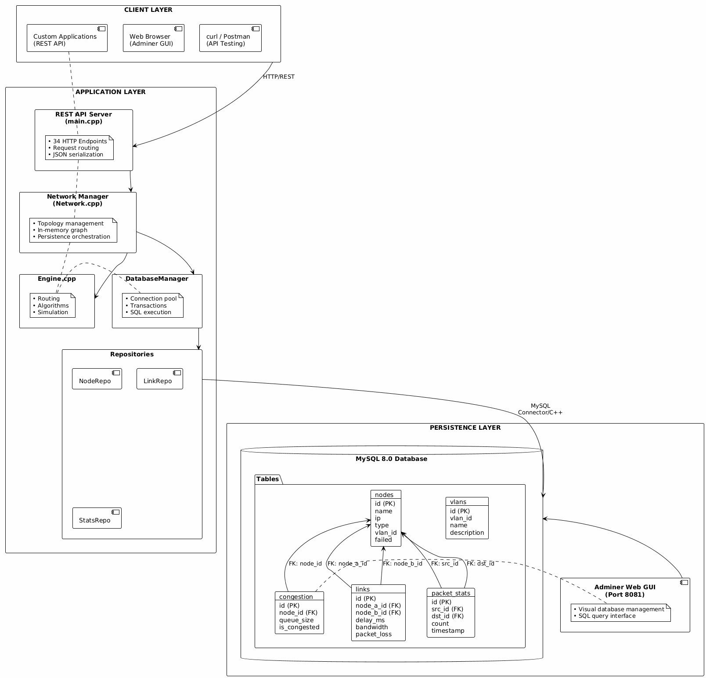
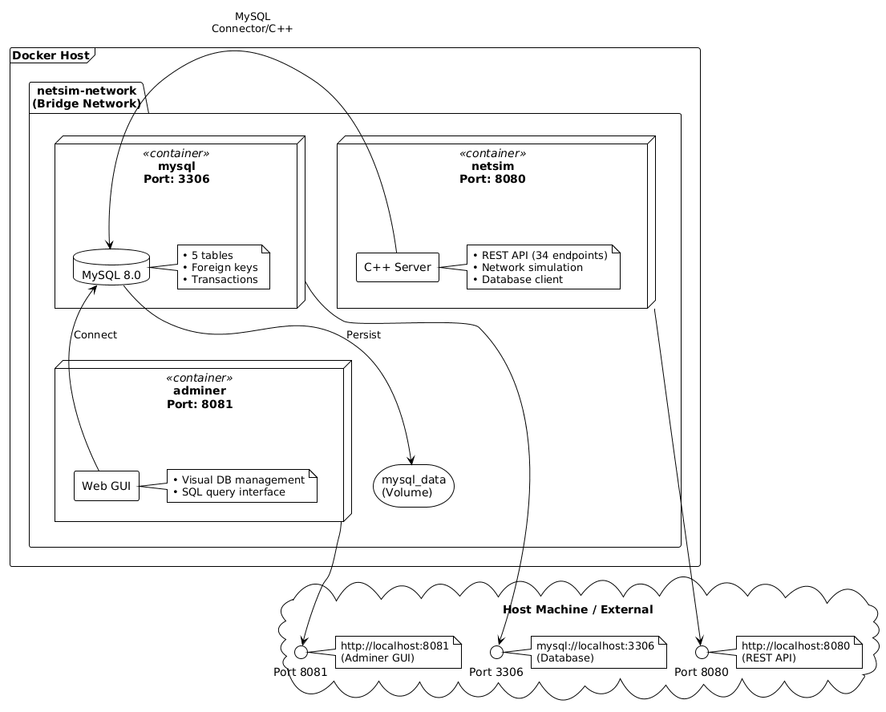

# NetSimCPP - Advanced Network Simulator

<div align="center">


**A comprehensive C++ network simulator with REST API, JWT authentication, YAML scenarios, production deployment, and extensive testing**

**[Quick Start Guide](QUICKSTART.md)** | **[Production Deployment](PRODUCTION_DEPLOY.md)** | **[API Documentation](docs/api.md)**

[English](#english) | [Polski](#polski)

</div>

---

## Security Notice

**CRITICAL: Never commit sensitive credentials to version control!**

### Before Deployment:

1. **Generate secure passwords**: Run `./scripts/generate_secrets.sh`
2. **Use `.env.production`** for production (not tracked in git)
3. **Use `.env.dev`** for local development (safe defaults)
4. **Change ALL passwords** in production (default dev passwords are NOT secure!)
5. **Enable HTTPS** in production (see [PRODUCTION_DEPLOY.md](PRODUCTION_DEPLOY.md))

### Files NEVER to commit:
- `.env.production` - Contains real production passwords
- `certbot_data/` - SSL certificates and private keys
- `*.pem`, `*.key`, `*.crt` - Cryptographic keys
- `backups/*.sql` - May contain sensitive data

**Full security checklist**: See [PRODUCTION_DEPLOY.md](PRODUCTION_DEPLOY.md)

**Quick reference**: See [INSTRUKCJA_PRACA.md](INSTRUKCJA_PRACA.md) for concise working guide

---

<a name="english"></a>

## English Version

### Table of Contents
- [Overview](#overview)
- [Features](#features)
- [Architecture](#architecture)
- [Authentication](#authentication)
- [Scenario System](#scenario-system)
- [WebSocket Real-Time](#websocket-real-time)
- [Production Deployment](#production-deployment)
- [Quick Start](#quick-start)
- [API Documentation](#api-documentation)
- [Testing](#testing)
- [CI/CD Pipeline](#cicd-pipeline)
- [Documentation](#documentation)
- [Contributing](#contributing)
- [License](#license)

---

### Overview

**NetSimCPP** is a production-ready network simulator built with modern C++17. It provides a comprehensive platform for:

- Creating and managing complex network topologies
- Simulating realistic network protocols (TCP, UDP, ICMP)
- Analyzing network behavior and performance
- RESTful API with JWT authentication (34 endpoints)
- YAML-based scenario automation with validation
- WebSocket real-time event broadcasting
- Full Docker containerization with MySQL persistence
- Production deployment with Nginx, HTTPS, and monitoring
- Extensive test coverage (61 unit tests + performance tests)

**Perfect for**: Network engineers, students, researchers, and developers learning network fundamentals, testing network algorithms, or building production network analysis tools.

---

### Features

#### Core Capabilities
- **Multi-Node Support**: Host, Router, Cloud, IoT devices
- **Advanced Routing**: Dynamic routing tables, load balancing
- **Protocol Simulation**: TCP 3-way handshake, UDP, ICMP ping
- **Network Properties**: Link delays, bandwidth limits, packet loss
- **VLAN & Firewall**: Network isolation and security rules

#### Advanced Features
- **Congestion Control**: Packet queuing and flow control
- **Packet Fragmentation**: MTU-aware fragmentation/reassembly
- **Time-Based Events**: Discrete event simulation
- **Cloud Integration**: Auto-scaling cloud node simulation
- **IoT Devices**: Battery-aware wireless sensor simulation
- **Topology Import/Export**: JSON-based configuration

#### Database Persistence 
- **MySQL Integration**: Full topology persistence
- **Statistics Tracking**: Packet transmission history
- **Save/Load**: Preserve network state across restarts
- **Web GUI**: Adminer for database management
- **5 Tables**: nodes, links, packet_stats, vlans, congestion
- **REST Endpoints**: `/db/enable`, `/db/save`, `/db/load`, `/db/status`

#### WebSocket Real-Time Updates
- **Live Monitoring**: Real-time network events without polling
- **Event Types**: Node add/remove/fail, link changes, packet transmission
- **Broadcast**: All connected clients receive instant notifications
- **Bi-directional**: Client ping/pong and subscriptions
- **Port**: `ws://localhost:9001`
- **Documentation**: [WebSocket API Guide](docs/WEBSOCKET_API.md)

#### Authentication & Security
- **JWT Authentication**: Secure token-based authentication
- **Password Hashing**: Argon2id for password storage
- **Redis Sessions**: Distributed session management
- **Rate Limiting**: Per-user API rate limits
- **Audit Logging**: Complete authentication audit trail
- **Documentation**: [Authentication Guide](docs/AUTHENTICATION.md)

#### Scenario Automation
- **YAML Parser**: Define complex network scenarios
- **Step Execution**: Sequential scenario execution with validation
- **Condition Support**: Conditional logic in scenarios
- **Loop Support**: Repeated operations in scenarios
- **Validation**: Pre-execution validation of all steps
- **Documentation**: [Scenarios Implementation](docs/SCENARIOS_IMPLEMENTATION.md)

#### REST API (34+ Endpoints)
- Node management (add, remove, fail)
- Link configuration (connect, delay, bandwidth)
- Network operations (ping, traceroute, multicast)
- Authentication (register, login, logout)
- Scenario management (load, step, run, status, reset)
- Statistics and monitoring
- Topology management
- Database operations (enable, save, load, status) 

#### Production Ready
- Docker containerization with MySQL and Redis
- Nginx reverse proxy with HTTPS/SSL support
- Let's Encrypt automatic SSL certificates
- Prometheus + Grafana monitoring stack
- Password generation and secret management
- CI/CD with GitHub Actions (61 tests passing)
- Memory leak detection (Valgrind)
- Static code analysis (cppcheck)
- Performance benchmarking
- WebSocket server for real-time updates

---

### Authentication

NetSimCPP provides enterprise-grade authentication with JWT tokens, Argon2 password hashing, and Redis-based session management.


#### Authentication Flow

1. **Registration**: User provides username, email, and password. Password is hashed with Argon2id before storage in MySQL.
2. **Login**: Credentials validated, JWT token generated and signed, session stored in Redis with expiration.
3. **Authenticated Requests**: Client sends JWT in Authorization header. Server validates signature and checks Redis session.
4. **Logout**: Token removed from Redis, immediate invalidation.

#### Security Features

- **Argon2id Password Hashing**: Industry-standard password hashing with configurable memory, iterations, and parallelism
- **JWT Tokens**: Signed with HS256, configurable expiration (default 24h)
- **Redis Session Store**: Distributed session management with automatic expiration
- **Rate Limiting**: Per-user API rate limits stored in MySQL
- **Audit Trail**: All authentication events logged to MySQL
- **HTTPS Support**: Production deployment with Nginx and Let's Encrypt

#### API Endpoints

```bash
# Register new user
curl -X POST http://localhost:8080/register \
  -H "Content-Type: application/json" \
  -d '{"username":"admin","email":"admin@example.com","password":"SecurePass123!"}'

# Login
curl -X POST http://localhost:8080/login \
  -H "Content-Type: application/json" \
  -d '{"username":"admin","password":"SecurePass123!"}'
# Returns: {"token":"eyJhbGc...","user_id":1}

# Use token in requests
curl -X POST http://localhost:8080/network/create \
  -H "Authorization: Bearer eyJhbGc..." \
  -H "Content-Type: application/json" \
  -d '{"name":"production_net"}'

# Logout
curl -X POST http://localhost:8080/logout \
  -H "Authorization: Bearer eyJhbGc..."
```

See [AUTHENTICATION.md](docs/AUTHENTICATION.md) for complete guide.

---

### Scenario System

YAML-based network scenario automation with validation and step-by-step execution.


#### Architecture

- **ScenarioParser**: Parses YAML files using yaml-cpp library, validates schema structure
- **ScenarioValidator**: Validates node existence, connectivity, protocols, and parameters before execution
- **ScenarioRunner**: Executes steps sequentially, manages state, handles conditions and loops
- **Network Engine**: Executes validated commands, processes packets, updates topology

#### Scenario Structure

```yaml
name: "Basic Ping Test"
description: "Test connectivity between two hosts"
author: "Network Admin"
version: "1.0"

topology:
  nodes:
    - name: "H1"
      type: "host"
      ip: "10.0.0.1"
    - name: "H2"
      type: "host"
      ip: "10.0.0.2"
  links:
    - nodeA: "H1"
      nodeB: "H2"
      delay: 10
      bandwidth: 1000

steps:
  - action: "ping"
    params:
      source: "H1"
      destination: "H2"
    expected_result: "success"
    
  - action: "link_delay"
    params:
      nodeA: "H1"
      nodeB: "H2"
      delay: 50
      
  - action: "ping"
    params:
      source: "H1"
      destination: "H2"
    expected_result: "success"
```

#### REST API

```bash
# Load scenario from file
curl -X POST http://localhost:8080/scenarios/load \
  -H "Authorization: Bearer TOKEN" \
  -H "Content-Type: application/json" \
  -d '{"filepath":"scenarios/basic_ping.yaml"}'

# Execute single step
curl -X POST http://localhost:8080/scenarios/step \
  -H "Authorization: Bearer TOKEN"

# Run entire scenario
curl -X POST http://localhost:8080/scenarios/run \
  -H "Authorization: Bearer TOKEN"

# Check status
curl http://localhost:8080/scenarios/status \
  -H "Authorization: Bearer TOKEN"

# Reset scenario
curl -X POST http://localhost:8080/scenarios/reset \
  -H "Authorization: Bearer TOKEN"
```

See [SCENARIOS_IMPLEMENTATION.md](docs/SCENARIOS_IMPLEMENTATION.md) for detailed documentation.

---

### WebSocket Real-Time

Real-time event broadcasting for live network monitoring without polling.


#### Event Types

- **node_added**: New node added to network
- **node_removed**: Node removed from network
- **node_failed**: Node failure simulated
- **link_added**: New link created
- **link_removed**: Link removed
- **link_modified**: Link properties changed (delay, bandwidth)
- **packet_sent**: Packet transmitted
- **packet_received**: Packet received
- **network_cleared**: Network topology cleared

#### Client Connection

```javascript
// Connect to WebSocket server
const ws = new WebSocket('ws://localhost:9001');

ws.onopen = () => {
  console.log('Connected to NetSimCPP');
};

ws.onmessage = (event) => {
  const data = JSON.parse(event.data);
  console.log('Event:', data);
  
  if (data.type === 'packet_sent') {
    updateUI(`Packet: ${data.from} -> ${data.to}`);
  }
};

// Send ping
ws.send(JSON.stringify({type: 'ping'}));

// Receive pong
// {"type":"pong","timestamp":"2025-11-02T22:00:00Z"}
```

#### Example Events

```json
{"type":"connected","clients":1}
{"type":"node_added","name":"router1","nodeType":"router"}
{"type":"link_added","nodeA":"H1","nodeB":"R1"}
{"type":"packet_sent","from":"H1","to":"H2","protocol":"ICMP"}
{"type":"link_modified","link":"H1-R1","delay":50}
```

See [WEBSOCKET_API.md](docs/WEBSOCKET_API.md) for complete WebSocket API documentation.

---

### Production Deployment

Enterprise-grade production deployment with Nginx, HTTPS, monitoring, and automated secret management.


#### Production Stack

- **Nginx**: Reverse proxy with HTTPS/SSL termination, rate limiting, security headers, WebSocket support
- **Backend**: NetSimCPP with JWT auth, scenario engine, WebSocket server
- **MySQL**: Database with persistent volumes, automated backups, connection pooling
- **Redis**: Session store for JWT sessions, rate limiting, temporary data
- **Prometheus**: Metrics collection from all services
- **Grafana**: Monitoring dashboards, application logs, alerting
- **Let's Encrypt**: Automatic SSL certificate generation and renewal

#### Quick Production Deploy

```bash
# 1. Generate secure passwords
./scripts/generate_secrets.sh
# Creates .env.production with:
# - DB_ROOT_PASSWORD (MySQL)
# - JWT_SECRET (64-char hex)
# - REDIS_PASSWORD
# - GRAFANA_PASSWORD

# 2. Configure domain in nginx/nginx.conf
nano nginx/nginx.conf
# Replace: your-domain.com

# 3. Deploy
docker compose -f docker-compose.prod.yml up -d

# 4. Generate SSL certificates
docker compose -f docker-compose.prod.yml exec nginx \
  certbot --nginx -d your-domain.com

# 5. Enable monitoring
docker compose -f docker-compose.monitoring.yml up -d

# Access:
# - API: https://your-domain.com
# - Grafana: https://your-domain.com:3000
# - Prometheus: https://your-domain.com:9090
```

#### Security Features

- **HTTPS Only**: All HTTP traffic redirected to HTTPS
- **SSL/TLS**: Let's Encrypt certificates with auto-renewal
- **Rate Limiting**: Nginx rate limiting (10 req/s per IP)
- **Security Headers**: HSTS, X-Frame-Options, CSP
- **Password Generation**: Automated secure password generation with OpenSSL
- **Secret Management**: Environment variables, no hardcoded credentials
- **Firewall**: Production firewall rules

#### Monitoring

- **Prometheus Metrics**: `/metrics` endpoint on all services
- **Grafana Dashboards**: Pre-configured dashboards for system metrics, application logs, alerts
- **Log Aggregation**: Centralized logging with retention policies
- **Alerts**: Slack/email notifications for critical events

See [PRODUCTION_DEPLOY.md](PRODUCTION_DEPLOY.md) (532 lines) for complete production deployment guide.

---

### Quick Start

#### Docker Deployment Architecture

Complete system architecture showing all layers (Client, Application, Persistence):



#### Database Schema

MySQL 8.0 database with 5 tables for persistent storage:


**Tables:**
- `nodes` - Network nodes (Host, Router, DummyNode)
- `links` - Network connections with properties
- `packet_stats` - Packet transmission statistics
- `vlans` - VLAN configurations
- `congestion` - Congestion tracking

#### Hybrid Architecture

In-memory (fast) + Database (persistent) approach:


**In-Memory:**
- Network topology (nodes, adjacency map)
- Packet queues
- Routing algorithms (BFS, Dijkstra)
- Real-time simulation state

**In Database:**
- Historical network configurations
- Packet statistics over time
- Node/Link metadata
- VLAN configurations
- Congestion records

#### Data Flow - Save Topology

How network topology is saved to database:


#### Data Flow - Load Topology

How network topology is loaded from database:


#### Legacy Class Diagram


#### Legacy Component Architecture


#### REST API Architecture


#### Core Components

```cpp
// Packet - Network packet representation
class Packet {
    std::string source, destination;
    std::string type;           // "ping", "data", "tcp", "udp"
    std::string protocol;       // "tcp", "udp", "icmp"
    std::string payload;
    int delay = 0;
    int ttl = 64;
    int priority = 0;
    
    // TCP fields
    bool syn = false, ack = false;
    int seqNum = 0, ackNum = 0;
    
    // Fragmentation
    int fragmentId = 0;
    bool isLast = false;
};

// Node - Abstract base class
class Node {
    std::string name;
    std::vector<Packet> queue;  // Congestion control
    virtual void receivePacket(Packet& p) = 0;
};

// Network - Main network manager
class Network {
    void addNode<T>(args...);
    void connect(nameA, nameB);
    std::string ping(source, dest);
    void exportToJson();
};

// Engine - Simulation engine
class Engine {
    std::string ping(src, dst, delay);
    std::vector<std::string> traceroute(src, dst);
    void multicast(src, destinations);
};
```

#### Use Case Diagram


#### Activity Diagram - Simulation Flow


#### TCP Handshake Sequence


#### Packet State Diagram


---

### API Documentation

Complete REST API with 34+ endpoints for network management, authentication, scenarios, and database operations.

#### Quick Examples

NetSimCPP runs in Docker with MySQL database and Adminer web GUI:



**Services:**
- **netsim** (Port 8080) - C++ REST API server
- **mysql** (Port 3306) - MySQL 8.0 database
- **adminer** (Port 8081) - Database web interface

#### Prerequisites
- **C++17** compiler (GCC 9+ or Clang 10+)
- **CMake** 3.10+
- **Docker** & Docker Compose (for containerized deployment)
- **Dependencies**: cpprestsdk, nlohmann-json, GoogleTest, OpenSSL, MySQL Connector/C++

#### Option 1: Docker Compose (Recommended) 

The easiest way to run NetSimCPP with full database support:

```bash
# Clone repository
git clone https://github.com/UmarlyPoeta/inzynieria_oprogramowania.git
cd inzynieria_oprogramowania

# Start all services (NetSimCPP + MySQL + Adminer)
docker-compose up -d

# Verify services are running
docker-compose ps

# Test the API
curl http://localhost:8080/status

# Access Adminer (MySQL Web GUI)
# Open http://localhost:8081 in browser
# Server: mysql, User: root, Password: NetSimCPP1234, Database: netsim

# Enable database persistence
curl -X POST http://localhost:8080/db/enable \
  -H "Content-Type: application/json" \
  -d '{
    "host": "mysql",
    "port": 3306,
    "user": "root",
    "password": "NetSimCPP1234",
    "database": "netsim"
  }'

# Create a node and save to database
curl -X POST http://localhost:8080/node/add \
  -d '{"name":"H1", "type":"host", "ip":"10.0.0.1"}'

curl http://localhost:8080/db/save

# View logs
docker-compose logs -f netsim

# Stop all services
docker-compose down
```

**Services:**
- **NetSimCPP Server**: http://localhost:8080
- **Adminer (MySQL GUI)**: http://localhost:8081
- **MySQL Database**: localhost:3306

#### Option 2: Local Build with Database

```bash
# Quick install (Ubuntu 22.04 LTS)
./scripts/install_deps.sh

# Or manual install:
sudo apt-get update && sudo apt-get install -y \
    build-essential cmake g++ \
    libcpprest-dev nlohmann-json3-dev \
    libssl-dev libgtest-dev \
    libmysqlcppconn-dev \
    libwebsocketpp-dev \
    libboost-system-dev \
    libboost-thread-dev \
    mysql-client

# Start MySQL (Docker)
cd project/database
docker-compose up -d
cd ../..

# Build project
cd project/backend
cmake .
make -j$(nproc)

# Run server
./netsim
# Server running at http://0.0.0.0:8080

# In another terminal: Enable database
curl -X POST http://localhost:8080/db/enable \
  -d '{"host":"127.0.0.1","user":"root","password":"NetSimCPP1234","database":"netsim"}'

# Run tests
./netsim_tests
./netsim_perf_tests
```

#### Option 3: Local Build without Database

```bash
# Install dependencies (Ubuntu/Debian)
sudo apt-get update && sudo apt-get install -y \
    build-essential cmake g++ \
    libcpprest-dev nlohmann-json3-dev \
    libssl-dev libgtest-dev

# Build
cd project/backend
cmake .
make -j$(nproc)

# Run server (in-memory only)
./netsim

# Run tests
./netsim_tests
./netsim_perf_tests
```

#### Quick Test Scripts

```bash
# Test authentication system
./test_auth.sh

# Test WebSocket connection
./scripts/test_websocket.sh

# Test full Docker stack
./scripts/test_docker.sh

# Test database integration
./scripts/test_database.sh

# Test CI/CD locally
./scripts/test_ci_cd.sh
```

---

### Architecture

NetSimCPP uses a **hybrid architecture** combining in-memory performance with database persistence, JWT authentication, and real-time WebSocket events.

#### System Overview

#### Quick Examples

```bash
# Check server status
curl http://localhost:8080/status

# Add nodes
curl -X POST http://localhost:8080/node/add \
  -H "Content-Type: application/json" \
  -d '{"name":"H1", "type":"host", "address":"10.0.0.1", "port":8080}'

curl -X POST http://localhost:8080/node/add \
  -H "Content-Type: application/json" \
  -d '{"name":"H2", "type":"host", "address":"10.0.0.2", "port":8080}'

# Connect nodes
curl -X POST http://localhost:8080/link/connect \
  -H "Content-Type: application/json" \
  -d '{"nodeA":"H1", "nodeB":"H2"}'

# Ping
curl -X POST http://localhost:8080/ping \
  -H "Content-Type: application/json" \
  -d '{"source":"H1", "destination":"H2"}'

# Get topology
curl http://localhost:8080/topology

# Get statistics
curl http://localhost:8080/statistics

# Enable database persistence
curl -X POST http://localhost:8080/db/enable \
  -H "Content-Type: application/json" \
  -d '{
    "host": "127.0.0.1",
    "port": 3306,
    "user": "root",
    "password": "NetSimCPP1234",
    "database": "netsim"
  }'

# Save topology to database
curl http://localhost:8080/db/save

# Load topology from database
curl http://localhost:8080/db/load

# Check database status
curl http://localhost:8080/db/status
```

#### Full API Reference (34 Endpoints)

**Node Management**
| Method | Endpoint | Description |
|--------|----------|-------------|
| GET | `/status` | Server health check |
| GET | `/nodes` | List all nodes |
| POST | `/node/add` | Add new node |
| POST | `/node/remove` | Remove node |
| POST | `/node/fail` | Simulate node failure |

**Link Management**
| Method | Endpoint | Description |
|--------|----------|-------------|
| POST | `/link/connect` | Connect two nodes |
| POST | `/link/disconnect` | Disconnect nodes |
| POST | `/link/delay` | Set link delay |
| POST | `/link/bandwidth` | Set bandwidth limit |
| POST | `/link/packetloss` | Configure packet loss |

**Network Operations**
| Method | Endpoint | Description |
|--------|----------|-------------|
| POST | `/ping` | ICMP ping |
| POST | `/traceroute` | Trace route |
| POST | `/multicast` | Multicast packet |
| POST | `/tcp/connect` | TCP connection |

**Topology & Statistics**
| Method | Endpoint | Description |
|--------|----------|-------------|
| GET | `/topology` | Export network topology |
| POST | `/topology/import` | Import topology |
| GET | `/statistics` | Network statistics |
| POST | `/statistics/reset` | Reset statistics |
| POST | `/metrics/performance` | Performance metrics |

**Advanced Features**
| Method | Endpoint | Description |
|--------|----------|-------------|
| POST | `/vlan/assign` | Assign VLAN to node |
| POST | `/firewall/rule` | Add firewall rule |
| POST | `/wireless/range` | Set wireless range |
| POST | `/wireless/interference` | Simulate interference |
| GET | `/cloudnodes` | List cloud nodes |
| POST | `/cloud/add` | Add cloud node |
| POST | `/cloud/scaleup` | Scale up cloud |
| POST | `/cloud/scaledown` | Scale down cloud |
| POST | `/iot/add` | Add IoT device |
| POST | `/iot/battery` | Battery drain |

**Database Persistence** 
| Method | Endpoint | Description |
|--------|----------|-------------|
| POST | `/db/enable` | Enable database persistence |
| POST | `/db/disable` | Disable database persistence |
| GET | `/db/status` | Check database connection status |
| GET | `/db/save` | Save current topology to database |
| GET | `/db/load` | Load topology from database |

See [API Full Workflow](docs/UML/API_FULL_WORKFLOW.png) for detailed sequence diagrams.

---

### Testing

#### Test Coverage
- **61 Unit Tests** (100% pass rate)
  - NetworkTest: 34 tests
  - EngineTest: 7 tests
  - RouterTest: 7 tests
  - HostTest: 3 tests
  - PacketTest: 6 tests
  - NodeTest: 3 tests
  - AuthenticationTest: 1 test (integration)

- **10 Performance Tests** (all passing)
  - Node creation: <1ms per node
  - Link creation: <0.5ms per link
  - Ping latency: <5ms through 20-node chain
  - Large network: 100 nodes setup <500ms
  - Topology export: <100ms for 50 nodes
  - Memory usage validation
  - Concurrent statistics access
  - Stress testing

- **Database Integration Tests** (automated) 
  - Connection testing
  - Save/Load cycle verification
  - Statistics persistence
  - Transaction rollback testing

- **Authentication Tests** (automated)
  - Registration flow
  - Login/logout cycle
  - JWT token validation
  - Session management
  - Password hashing verification

#### Running Tests

```bash
# Unit tests
cd project/backend
./netsim_tests

# Performance tests
./netsim_perf_tests

# Database tests
../scripts/test_database.sh

# With XML output
./netsim_tests --gtest_output=xml:test-results.xml

# Memory leak check
valgrind --leak-check=full ./netsim_tests

# Docker tests
./scripts/test_docker.sh
```

#### Test Results Example
```
[==========] Running 60 tests from 6 test suites.
[----------] 34 tests from NetworkTest
[  PASSED  ] 60 tests.
```

See [docs/testing.md](docs/testing.md) for comprehensive testing guide.

---

### CI/CD Pipeline

#### GitHub Actions Workflow

Our CI/CD pipeline runs on every push and PR with full MySQL database integration:


#### CI/CD Pipeline Diagram

Complete workflow showing all jobs and database integration:


#### Pipeline Jobs

1. **Build & Test** (60 unit tests)
   - **MySQL Service**: Start MySQL 8.0 container
   - **Database Setup**: Load schema (NetSimDB.sql)
   - Compile project with MySQL Connector/C++
   - Run all unit tests
   - **Database Tests**: Verify DB connectivity
   - Publish test results
   - Upload artifacts

2. **Performance Tests**
   - **MySQL Service**: Database available for tests
   - Run 10 performance benchmarks
   - Memory leak detection (Valgrind)
   - Performance validation

3. **Docker Build**
   - Build Docker image (NetSimCPP + MySQL deps)
   - **Docker Compose**: Start full stack (netsim + mysql + adminer)
   - Test containerized app
   - **Integration Tests**: Enable DB, save/load topology
   - Validate API endpoints (34 total)
   - Show logs on failure

4. **Code Quality**
   - Static analysis (cppcheck)
   - Code style validation
   - Security checks

#### Workflow File
```yaml
# .github/workflows/ci-cd.yml
name: NetSimCPP CI/CD
on: [push, pull_request]

jobs:
  build-and-test:
    runs-on: ubuntu-22.04
    steps:
      - Compile & Test
      - Publish Results
      
  performance-tests:
    steps:
      - Performance Benchmarks
      - Valgrind Memory Check
      
  docker-build:
    steps:
      - Build Image
      - Test Container
      
  code-quality:
    steps:
      - cppcheck Analysis
```

---

### Documentation

#### Core Documentation
- **[Quick Start Guide](QUICKSTART.md)** - 5-minute setup guide
- **[Working Guide](INSTRUKCJA_PRACA.md)** - Concise reference for daily work
- **[Architecture Documentation](docs/architecture.md)** - System design and patterns
- **[Architecture with Database](docs/ARCHITECTURE_WITH_DB.md)** - Complete architecture diagrams
- **[Testing Guide](docs/testing.md)** - Comprehensive testing documentation
- **[API Documentation](docs/api.md)** - REST API reference

#### Security & Deployment
- **[Production Deployment](PRODUCTION_DEPLOY.md)** - Complete production deployment guide (532 lines)
- **[Authentication Guide](docs/AUTHENTICATION.md)** - JWT authentication, passwords, sessions
- **[API Security](docs/API_SECURITY.md)** - Security best practices

#### Feature Documentation
- **[Scenarios Implementation](docs/SCENARIOS_IMPLEMENTATION.md)** - YAML scenario system
- **[WebSocket API](docs/WEBSOCKET_API.md)** - Real-time event broadcasting

#### Diagrams
- **[UML Diagrams](docs/UML/)** - PlantUML generated diagrams
  - System Overview (Component Diagram)
  - Authentication Flow (Sequence Diagram)
  - Scenario System (Component Diagram)
  - WebSocket Flow (Sequence Diagram)
  - Production Deployment (Deployment Diagram)
  - Save Topology (Sequence Diagram)
  - Load Topology (Sequence Diagram)
  - Docker Deployment (Deployment Diagram)
  - CI/CD Pipeline (Activity Diagram)
  - Hybrid Architecture (Component Diagram)
  - Database Schema (Database Diagram)
- **[PlantUML Sources](docs/)** - Source .puml files for all diagrams

#### Database Documentation
- **[Database README](project/database/README.md)** - MySQL schema and queries
- **[Auth Schema](project/database/AuthSchema.sql)** - Authentication tables SQL

---

### Contributing

1. Fork the repository
2. Create feature branch (`git checkout -b feature/amazing-feature`)
3. Commit changes (`git commit -m 'Add amazing feature'`)
4. Push to branch (`git push origin feature/amazing-feature`)
5. Open Pull Request

All contributions must pass CI/CD checks!

---

### License

This project is licensed under the MIT License - see the LICENSE file for details.

---

### Authors

- **Patryk Kozłowski** - BACKEND, REST API, CI/CD, SCRIPTS, DOCS, UML
- **Adrian Lorek** - DATABASE
- **Oliwier Kruczek** - FRONTEND 

---

### Acknowledgments

- Built with [cpprestsdk](https://github.com/microsoft/cpprestsdk) for REST API
- Testing with [GoogleTest](https://github.com/google/googletest)
- JSON handling with [nlohmann/json](https://github.com/nlohmann/json)

---

<a name="polski"></a>

## Wersja Polska

### Spis Treści
- [Przegląd](#przegląd-pl)
- [Funkcje](#funkcje-pl)
- [Architektura](#architektura-pl)
- [Autentykacja](#autentykacja-pl)
- [System Scenariuszy](#system-scenariuszy-pl)
- [WebSocket Czas Rzeczywisty](#websocket-czas-rzeczywisty-pl)
- [Wdrożenie Produkcyjne](#wdrożenie-produkcyjne-pl)
- [Szybki Start](#szybki-start-pl)
- [Dokumentacja API](#dokumentacja-api-pl)
- [Testowanie](#testowanie-pl)
- [Pipeline CI/CD](#pipeline-cicd-pl)
- [Dokumentacja](#dokumentacja-pl)
- [Współpraca](#współpraca-pl)
- [Licencja](#licencja-pl)

---

### Przegląd {#przegląd-pl}

**NetSimCPP** to gotowy do produkcji symulator sieci zbudowany w nowoczesnym C++17. Zapewnia kompleksową platformę do:

- Tworzenia i zarządzania złożonymi topologiami sieciowymi
- Symulacji realistycznych protokołów sieciowych (TCP, UDP, ICMP)
- Analizy zachowania i wydajności sieci
- API RESTful z autentykacją JWT (34+ endpointy)
- Automatyzacja scenariuszy oparta na YAML z walidacją
- Transmisja zdarzeń w czasie rzeczywistym przez WebSocket
- Pełna konteneryzacja Docker z persystencją MySQL
- Wdrożenie produkcyjne z Nginx, HTTPS i monitoringiem
- Rozbudowane pokrycie testami (61 testów jednostkowych + testy wydajnościowe)

**Idealne dla**: Inżynierów sieciowych, studentów, naukowców i programistów uczących się podstaw sieci, testujących algorytmy sieciowe lub budujących produkcyjne narzędzia analizy sieci.

---

### Funkcje {#funkcje-pl}

#### Główne Możliwości
- **Wsparcie Wielu Węzłów**: Host, Router, Cloud, urządzenia IoT
- **Zaawansowane Routowanie**: Dynamiczne tablice routingu, balansowanie obciążenia
- **Symulacja Protokołów**: TCP 3-way handshake, UDP, ICMP ping
- **Właściwości Sieci**: Opóźnienia linków, limity przepustowości, utrata pakietów
- **VLAN i Firewall**: Izolacja sieci i reguły bezpieczeństwa

#### Zaawansowane Funkcje
- **Kontrola Przeciążenia**: Kolejkowanie pakietów i kontrola przepływu
- **Fragmentacja Pakietów**: Fragmentacja/składanie z uwzględnieniem MTU
- **Zdarzenia Czasowe**: Symulacja zdarzeń dyskretnych
- **Integracja z Chmurą**: Symulacja automatycznego skalowania węzłów chmury
- **Urządzenia IoT**: Symulacja czujników bezprzewodowych z uwzględnieniem baterii
- **Import/Export Topologii**: Konfiguracja oparta na JSON

#### Persystencja Bazy Danych 
- **Integracja MySQL**: Pełna persystencja topologii
- **Śledzenie Statystyk**: Historia transmisji pakietów
- **Zapisz/Wczytaj**: Zachowanie stanu sieci między restartami
- **Web GUI**: Adminer do zarządzania bazą danych
- **5 Tabel**: nodes, links, packet_stats, vlans, congestion
- **Endpointy REST**: `/db/enable`, `/db/save`, `/db/load`, `/db/status`

#### WebSocket Aktualizacje Czasu Rzeczywistego
- **Monitorowanie Na Żywo**: Wydarzenia sieciowe w czasie rzeczywistym bez odpytywania
- **Typy Zdarzeń**: Dodawanie/usuwanie/awarie węzłów, zmiany linków, transmisja pakietów
- **Broadcast**: Wszyscy podłączeni klienci otrzymują natychmiastowe powiadomienia
- **Dwukierunkowy**: Ping/pong klienta i subskrypcje
- **Port**: `ws://localhost:9001`
- **Dokumentacja**: [Przewodnik WebSocket API](docs/WEBSOCKET_API.md)

#### Autentykacja i Bezpieczeństwo
- **Autentykacja JWT**: Bezpieczna autentykacja oparta na tokenach
- **Hashowanie Haseł**: Argon2id do przechowywania haseł
- **Sesje Redis**: Rozproszone zarządzanie sesjami
- **Rate Limiting**: Limity API na użytkownika
- **Audyt Logowania**: Pełny audyt autentykacji
- **Dokumentacja**: [Przewodnik Autentykacji](docs/AUTHENTICATION.md)

#### Automatyzacja Scenariuszy
- **Parser YAML**: Definiowanie złożonych scenariuszy sieciowych
- **Wykonywanie Kroków**: Sekwencyjne wykonywanie scenariuszy z walidacją
- **Wsparcie Warunków**: Logika warunkowa w scenariuszach
- **Wsparcie Pętli**: Powtarzające się operacje w scenariuszach
- **Walidacja**: Walidacja przed wykonaniem wszystkich kroków
- **Dokumentacja**: [Implementacja Scenariuszy](docs/SCENARIOS_IMPLEMENTATION.md)

#### REST API (34+ Endpointy)
- Zarządzanie węzłami (dodawanie, usuwanie, awarie)
- Konfiguracja linków (połączenia, opóźnienia, przepustowość)
- Operacje sieciowe (ping, traceroute, multicast)
- Autentykacja (rejestracja, logowanie, wylogowanie)
- Zarządzanie scenariuszami (ładowanie, krok, uruchamianie, status, reset)
- Statystyki i monitorowanie
- Zarządzanie topologią
- Operacje bazodanowe (enable, save, load, status) 

#### Gotowe do Produkcji
- Konteneryzacja Docker z MySQL i Redis
- Nginx reverse proxy z wsparciem HTTPS/SSL
- Automatyczne certyfikaty SSL Let's Encrypt
- Stack monitoringu Prometheus + Grafana
- Generowanie haseł i zarządzanie sekretami
- CI/CD z GitHub Actions (61 testów przechodzi)
- Detekcja wycieków pamięci (Valgrind)
- Statyczna analiza kodu (cppcheck)
- Benchmarking wydajności
- Serwer WebSocket dla aktualizacji w czasie rzeczywistym

---

### Architektura {#architektura-pl}

NetSimCPP wykorzystuje **architekturę hybrydową** łączącą wydajność pamięci operacyjnej z trwałością bazy danych, autentykacją JWT i zdarzeniami WebSocket w czasie rzeczywistym.

#### Przegląd Systemu

Kompletna architektura systemu pokazująca wszystkie warstwy (Klient, Aplikacja, Persystencja):


#### Schemat Bazy Danych

Baza danych MySQL 8.0 z 5 tabelami do trwałego przechowywania:


**Tabele:**
- `nodes` - Węzły sieci (Host, Router, DummyNode)
- `links` - Połączenia sieciowe z właściwościami
- `packet_stats` - Statystyki transmisji pakietów
- `vlans` - Konfiguracje VLAN
- `congestion` - Śledzenie przeciążeń

#### Architektura Hybrydowa

Podejście: Pamięć operacyjna (szybka) + Baza danych (trwała):


**W Pamięci:**
- Topologia sieci (węzły, mapa sąsiedztwa)
- Kolejki pakietów
- Algorytmy routingu (BFS, Dijkstra)
- Stan symulacji w czasie rzeczywistym

**W Bazie Danych:**
- Historyczne konfiguracje sieci
- Statystyki pakietów w czasie
- Metadane węzłów/połączeń
- Konfiguracje VLAN
- Rekordy przeciążeń

#### Przepływ Danych - Zapis Topologii

Jak topologia sieci jest zapisywana do bazy danych:


#### Przepływ Danych - Wczytywanie Topologii

Jak topologia sieci jest wczytywana z bazy danych:


#### Diagram Klas (Legacy)


#### Architektura Komponentów (Legacy)


#### Architektura REST API


#### Główne Komponenty

```cpp
// Packet - Reprezentacja pakietu sieciowego
class Packet {
    std::string source, destination;
    std::string type;           // "ping", "data", "tcp", "udp"
    std::string protocol;       // "tcp", "udp", "icmp"
    std::string payload;
    int delay = 0;
    int ttl = 64;
    int priority = 0;
    
    // Pola TCP
    bool syn = false, ack = false;
    int seqNum = 0, ackNum = 0;
    
    // Fragmentacja
    int fragmentId = 0;
    bool isLast = false;
};

// Node - Abstrakcyjna klasa bazowa
class Node {
    std::string name;
    std::vector<Packet> queue;  // Kontrola przeciążenia
    virtual void receivePacket(Packet& p) = 0;
};

// Network - Główny menedżer sieci
class Network {
    void addNode<T>(args...);
    void connect(nameA, nameB);
    std::string ping(source, dest);
    void exportToJson();
};

// Engine - Silnik symulacji
class Engine {
    std::string ping(src, dst, delay);
    std::vector<std::string> traceroute(src, dst);
    void multicast(src, destinations);
};
```

#### Diagram Przypadków Użycia


#### Diagram Aktywności - Przepływ Symulacji


#### Sekwencja TCP Handshake


#### Diagram Stanów Pakietu


---

### Szybki Start {#szybki-start-pl}

#### Architektura Wdrożenia Docker

NetSimCPP działa w Docker z bazą danych MySQL i interfejsem webowym Adminer:


**Serwisy:**
- **netsim** (Port 8080) - Serwer REST API w C++
- **mysql** (Port 3306) - Baza danych MySQL 8.0
- **adminer** (Port 8081) - Interfejs webowy bazy danych

#### Wymagania
- **C++17** kompilator (GCC 9+ lub Clang 10+)
- **CMake** 3.10+
- **Docker** & Docker Compose (dla wdrożenia kontenerowego)
- **Zależności**: cpprestsdk, nlohmann-json, GoogleTest, OpenSSL, MySQL Connector/C++

#### Opcja 1: Docker Compose (Zalecane) 🐳 

Najłatwiejszy sposób uruchomienia NetSimCPP z pełnym wsparciem bazy danych:

```bash
# Zbuduj i uruchom
docker-compose up

# Przetestuj API
curl http://localhost:8080/status
```

#### Opcja 2: Lokalna Kompilacja

```bash
# Zainstaluj zależności (Ubuntu/Debian)
sudo apt-get update && sudo apt-get install -y \
    build-essential cmake g++ \
    libcpprest-dev nlohmann-json3-dev \
    libssl-dev libgtest-dev

# Kompilacja
cd project/backend
cmake .
make -j$(nproc)

# Uruchom serwer
./netsim
# Serwer działa na http://0.0.0.0:8080

# Uruchom testy
./netsim_tests
./netsim_perf_tests
```

#### Opcja 3: Używając Skryptów Testowych

```bash
# Testuj konfigurację Docker
./scripts/test_docker.sh

# Testuj CI/CD lokalnie
./scripts/test_ci_cd.sh
```

---

### 📡 Dokumentacja API {#dokumentacja-api-pl}

#### Szybkie Przykłady

```bash
# Sprawdź status serwera
curl http://localhost:8080/status

# Dodaj węzły
curl -X POST http://localhost:8080/node/add \
  -H "Content-Type: application/json" \
  -d '{"name":"H1", "type":"host", "address":"10.0.0.1", "port":8080}'

curl -X POST http://localhost:8080/node/add \
  -H "Content-Type: application/json" \
  -d '{"name":"H2", "type":"host", "address":"10.0.0.2", "port":8080}'

# Połącz węzły
curl -X POST http://localhost:8080/link/connect \
  -H "Content-Type: application/json" \
  -d '{"nodeA":"H1", "nodeB":"H2"}'

# Ping
curl -X POST http://localhost:8080/ping \
  -H "Content-Type: application/json" \
  -d '{"source":"H1", "destination":"H2"}'

# Pobierz topologię
curl http://localhost:8080/topology

# Pobierz statystyki
curl http://localhost:8080/statistics
```

#### Pełna Dokumentacja API (29 Endpointów)

| Metoda | Endpoint | Opis |
|--------|----------|------|
| GET | `/status` | Sprawdzenie stanu serwera |
| GET | `/nodes` | Lista wszystkich węzłów |
| GET | `/topology` | Eksport topologii sieci |
| GET | `/statistics` | Statystyki sieci |
| GET | `/cloudnodes` | Lista węzłów chmury |
| POST | `/node/add` | Dodaj nowy węzeł |
| POST | `/node/remove` | Usuń węzeł |
| POST | `/node/fail` | Symuluj awarię węzła |
| POST | `/link/connect` | Połącz dwa węzły |
| POST | `/link/disconnect` | Rozłącz węzły |
| POST | `/link/delay` | Ustaw opóźnienie linku |
| POST | `/link/bandwidth` | Ustaw limit przepustowości |
| POST | `/link/packetloss` | Skonfiguruj utratę pakietów |
| POST | `/vlan/assign` | Przypisz VLAN do węzła |
| POST | `/firewall/rule` | Dodaj regułę firewall |
| POST | `/ping` | ICMP ping |
| POST | `/traceroute` | Śledzenie trasy |
| POST | `/multicast` | Pakiet multicast |
| POST | `/tcp/connect` | Połączenie TCP |
| POST | `/topology/import` | Importuj topologię |
| POST | `/wireless/range` | Ustaw zasięg bezprzewodowy |
| POST | `/wireless/interference` | Symuluj zakłócenia |
| POST | `/cloud/add` | Dodaj węzeł chmury |
| POST | `/cloud/scaleup` | Skaluj w górę chmurę |
| POST | `/cloud/scaledown` | Skaluj w dół chmurę |
| POST | `/iot/add` | Dodaj urządzenie IoT |
| POST | `/iot/battery` | Rozładowanie baterii |
| POST | `/statistics/reset` | Zresetuj statystyki |
| POST | `/metrics/performance` | Metryki wydajności |

Zobacz [API Full Workflow](docs/UML/API_FULL_WORKFLOW.png) dla szczegółowych diagramów sekwencji.

---

### Testowanie {#testowanie-pl}

#### Pokrycie Testami
- **60 Testów Jednostkowych** (100% wskaźnik przejścia)
  - NetworkTest: 34 testy
  - EngineTest: 7 testów
  - RouterTest: 7 testów
  - HostTest: 3 testy
  - PacketTest: 6 testów
  - NodeTest: 3 testy

- **10 Testów Wydajnościowych** (wszystkie przechodzą)
  - Tworzenie węzłów: <1ms na węzeł
  - Tworzenie linków: <0.5ms na link
  - Opóźnienie ping: <5ms przez łańcuch 20 węzłów
  - Duża sieć: 100 węzłów setup <500ms
  - Eksport topologii: <100ms dla 50 węzłów
  - Walidacja użycia pamięci
  - Współbieżny dostęp do statystyk
  - Testy obciążeniowe

#### Uruchamianie Testów

```bash
# Testy jednostkowe
cd project/backend
./netsim_tests

# Testy wydajnościowe
./netsim_perf_tests

# Z wyjściem XML
./netsim_tests --gtest_output=xml:test-results.xml

# Sprawdzanie wycieków pamięci
valgrind --leak-check=full ./netsim_tests

# Testy Dockera
./scripts/test_docker.sh
```

#### Przykład Wyników Testów
```
[==========] Uruchamianie 60 testów z 6 zestawów testowych.
[----------] 34 testy z NetworkTest
[  PASSED  ] 60 testów.
```

Zobacz [docs/testing.md](docs/testing.md) dla kompleksowego przewodnika po testowaniu.

---

### Pipeline CI/CD {#pipeline-cicd-pl}

#### Workflow GitHub Actions

Nasz pipeline CI/CD uruchamia się przy każdym push i PR z pełną integracją bazy danych MySQL:


#### Diagram Pipeline CI/CD

Kompletny workflow pokazujący wszystkie zadania i integrację z bazą danych:


#### Zadania Pipeline

1. **Build & Test** (60 testów jednostkowych)
   - **Serwis MySQL**: Start kontenera MySQL 8.0
   - **Konfiguracja Bazy**: Wczytanie schematu (NetSimDB.sql)
   - Kompilacja projektu z MySQL Connector/C++
   - Uruchomienie wszystkich testów jednostkowych
   - **Testy Bazy**: Weryfikacja połączenia z DB
   - Publikacja wyników testów
   - Upload artefaktów

2. **Testy Wydajnościowe**
   - **Serwis MySQL**: Baza dostępna dla testów
   - Uruchomienie 10 benchmarków wydajności
   - Detekcja wycieków pamięci (Valgrind)
   - Walidacja wydajności

3. **Build Docker**
   - Budowanie obrazu Docker (NetSimCPP + zależności MySQL)
   - **Docker Compose**: Start pełnego stacku (netsim + mysql + adminer)
   - Testowanie aplikacji w kontenerze
   - **Testy Integracyjne**: Włączenie DB, zapis/odczyt topologii
   - Walidacja endpointów API (34 total)
   - Wyświetlanie logów przy błędzie

4. **Jakość Kodu**
   - Analiza statyczna (cppcheck)
   - Walidacja stylu kodu
   - Sprawdzenia bezpieczeństwa

#### Plik Workflow
```yaml
# .github/workflows/ci-cd.yml
name: NetSimCPP CI/CD
on: [push, pull_request]

jobs:
  build-and-test:
    runs-on: ubuntu-22.04
    steps:
      - Kompilacja i Testy
      - Publikacja Wyników
      
  performance-tests:
    steps:
      - Benchmarki Wydajności
      - Sprawdzanie Pamięci Valgrind
      
  docker-build:
    steps:
      - Budowanie Obrazu
      - Testowanie Kontenera
      
  code-quality:
    steps:
      - Analiza cppcheck
```

---

### Dokumentacja {#dokumentacja-pl}

#### Podstawowa Dokumentacja
- **[Szybki Start](QUICKSTART.md)** - 5-minutowy przewodnik 🚀 
- **[Dokumentacja Architektury](project/docs/architecture.md)** - Projekt systemu i wzorce
- **[Architektura z Bazą Danych](docs/ARCHITECTURE_WITH_DB.md)** - Kompletne diagramy architektury 
- **[Przewodnik Testowania](docs/testing.md)** - Kompleksowa dokumentacja testów
- **[Dokumentacja API](project/docs/overview.md)** - Szczegóły REST API

#### Diagramy
- **[Diagramy UML](project/docs/UML/)** - Pliki źródłowe PlantUML 
  - Przegląd Systemu (Diagram Komponentów)
  - Zapis Topologii (Diagram Sekwencji)
  - Wczytywanie Topologii (Diagram Sekwencji)
  - Wdrożenie Docker (Diagram Wdrożenia)
  - Pipeline CI/CD (Diagram Aktywności)
  - Architektura Hybrydowa (Diagram Komponentów)
- **[Diagramy Legacy](project/docs/diagrams.md)** - Oryginalne schematy blokowe

#### Dokumentacja Bazy Danych
- **[Plan Integracji Bazy Danych](docs/database_integration_plan.md)** - Architektura i projekt 
- **[Przewodnik Instalacji Bazy](docs/INSTALL_DATABASE.md)** - Instalacja krok po kroku 
- **[Implementacja Bazy Danych](docs/DATABASE_IMPLEMENTATION.md)** - Podsumowanie implementacji 
- **[Dokumentacja API Bazy](project/database/README.md)** - Schema MySQL i zapytania 

---

### Współpraca {#współpraca-pl}

1. Zforkuj repozytorium
2. Utwórz branch funkcjonalności (`git checkout -b feature/amazing-feature`)
3. Commituj zmiany (`git commit -m 'Dodaj niesamowitą funkcję'`)
4. Push do brancha (`git push origin feature/amazing-feature`)
5. Otwórz Pull Request

Wszystkie kontrybucje muszą przejść sprawdzenia CI/CD!

---

### Licencja {#licencja-pl}

Ten projekt jest licencjonowany na licencji MIT - zobacz plik LICENSE dla szczegółów.

---

### Autorzy

- **Patryk Kozłowski** - Backend, REST API, Autentykacja, Scenariusze, WebSocket, CI/CD, Skrypty, Dokumentacja, Diagramy UML
- **Adrian Lorek** - Schemat Bazy Danych, Integracja MySQL, Warstwa Persystencji
- **Oliwier Kruczek** - Rozwój Frontendu

---

### Podziękowania

- Zbudowane z [cpprestsdk](https://github.com/microsoft/cpprestsdk) dla REST API
- Testowanie z [GoogleTest](https://github.com/google/googletest)
- Obsługa JSON z [nlohmann/json](https://github.com/nlohmann/json)
- Integracja MySQL z [MySQL Connector/C++](https://dev.mysql.com/downloads/connector/cpp/)
- Implementacja JWT z [jwt-cpp](https://github.com/Thalhammer/jwt-cpp)
- Hashowanie haseł z [Argon2](https://github.com/P-H-C/phc-winner-argon2)
- Klient Redis z [hiredis](https://github.com/redis/hiredis)
- Parsowanie YAML z [yaml-cpp](https://github.com/jbeder/yaml-cpp)
- WebSocket z [websocketpp](https://github.com/zaphoyd/websocketpp)

---

<div align="center">

**NetSimCPP v1.0 - Gotowy do Produkcji Symulator Sieci**

Stworzony przez studentów AGH

[Zgłoś Bug](https://github.com/UmarlyPoeta/inzynieria_oprogramowania/issues) | [Poproś o Funkcję](https://github.com/UmarlyPoeta/inzynieria_oprogramowania/issues) | [Dokumentacja](docs/)

</div>
