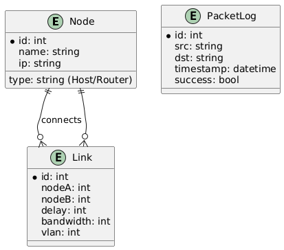

# 🗄️ NetSimCPP - Database Module



## 📋 Overview

This module provides **MySQL database persistence** for the NetSimCPP network simulator. It allows saving and loading network topologies, tracking statistics, and maintaining historical data.

---

## 🎯 Purpose

### Why Database Integration?

Currently, NetSimCPP runs entirely in RAM - all data is lost on restart. Database integration enables:

1. **Persistence** 
   - Network topologies survive server restarts
   - Traffic statistics history
   - Network change auditing

2. **Scalability**
   - Support for multiple concurrent simulations
   - Historical data analysis
   - Future multi-user support

3. **Monitoring & Analytics**
   - Track network performance over time
   - Identify bottlenecks
   - Predict congestion

---

## 📊 Database Schema

### Tables

```
┌─────────────┐
│   nodes     │ ← Network nodes (Host, Router, Switch)
├─────────────┤
│ id          │ PK
│ name        │ UNIQUE, NOT NULL
│ ip          │ VARCHAR(45)
│ type        │ ENUM('host','router','switch','unknown')
│ vlan_id     │ INT
│ failed      │ BOOLEAN (failure simulation)
│ created_at  │ TIMESTAMP
└─────────────┘

┌─────────────┐
│   links     │ ← Connections between nodes
├─────────────┤
│ id          │ PK
│ node_a_id   │ FK → nodes(id)
│ node_b_id   │ FK → nodes(id)
│ delay_ms    │ INT (latency)
│ bandwidth   │ INT (Mbps)
│ packet_loss │ FLOAT (percentage)
└─────────────┘
    │
    │ UNIQUE(node_a_id, node_b_id)
    │ CASCADE DELETE

┌──────────────┐
│ packet_stats │ ← Transmission statistics
├──────────────┤
│ id           │ PK
│ src_node_id  │ FK → nodes(id)
│ dst_node_id  │ FK → nodes(id)
│ packet_count │ INT
│ last_update  │ TIMESTAMP
└──────────────┘

┌─────────────┐
│   vlans     │ ← VLAN configuration
├─────────────┤
│ id          │ PK
│ vlan_id     │ INT, NOT NULL
│ name        │ VARCHAR(100)
│ description │ TEXT
│ created_at  │ TIMESTAMP
└─────────────┘

┌─────────────┐
│ congestion  │ ← Congestion monitoring
├─────────────┤
│ id          │ PK
│ node_id     │ FK → nodes(id)
│ queue_size  │ INT
│ is_congested│ BOOLEAN
└─────────────┘
```

---

## 🚀 Quick Start

### Option 1: Docker (Recommended)

```bash
# Start MySQL database
cd project/database
docker-compose -f docker-compose-db.yml up -d

# Verify
docker-compose -f docker-compose-db.yml ps

# Access Adminer (Web UI)
# http://localhost:8081
# Server: mysql
# Username: root
# Password: NetSimCPP1234
# Database: netsim
```

### Option 2: Local MySQL

```bash
# Install MySQL 8.0+
sudo apt-get install mysql-server

# Create database
mysql -u root -p
CREATE DATABASE netsim;
USE netsim;
SOURCE project/database/NetSimDB.sql;
EXIT;

# Configure credentials in .env
cp project/database/.env.example project/database/.env
# Edit .env with your credentials
```

---

## 🔧 Configuration

### Environment Variables (.env)

```env
DB_HOST=127.0.0.1
DB_PORT=3306
DB_USER=root
DB_PASS=NetSimCPP1234
DB_NAME=netsim
```

⚠️ **Security Note:** Never commit `.env` to git!

```bash
# Add to .gitignore
echo "project/database/.env" >> .gitignore
```

---

## 📡 API Usage

### Save Topology to Database

```bash
# Create some nodes via REST API
curl -X POST http://localhost:8080/node/add \
  -H "Content-Type: application/json" \
  -d '{"name":"H1", "type":"host", "address":"10.0.0.1", "port":8080}'

curl -X POST http://localhost:8080/node/add \
  -H "Content-Type: application/json" \
  -d '{"name":"H2", "type":"host", "address":"10.0.0.2", "port":8080}'

# Connect nodes
curl -X POST http://localhost:8080/link/connect \
  -H "Content-Type: application/json" \
  -d '{"nodeA":"H1", "nodeB":"H2"}'

# Save topology to database
curl http://localhost:8080/topology/save
```

### Load Topology from Database

```bash
# Load topology (e.g., after server restart)
curl http://localhost:8080/topology/load

# Verify nodes loaded
curl http://localhost:8080/nodes
```

### Query Statistics

```bash
# Get packet statistics between nodes
curl "http://localhost:8080/stats/history?src=H1&dst=H2"
```

---

## 🧪 Testing

### Test Database Connection

```bash
# Test MySQL connection
mysql -h 127.0.0.1 -u root -pNetSimCPP1234 -e "SHOW DATABASES;"

# List tables
mysql -h 127.0.0.1 -u root -pNetSimCPP1234 netsim -e "SHOW TABLES;"

# View nodes
mysql -h 127.0.0.1 -u root -pNetSimCPP1234 netsim -e "SELECT * FROM nodes;"
```

### Sample Queries

```sql
-- Top 10 most active node pairs
SELECT 
    n1.name AS source,
    n2.name AS destination,
    ps.packet_count,
    ps.last_update
FROM packet_stats ps
JOIN nodes n1 ON ps.src_node_id = n1.id
JOIN nodes n2 ON ps.dst_node_id = n2.id
ORDER BY ps.packet_count DESC
LIMIT 10;

-- Nodes with highest congestion
SELECT 
    n.name,
    n.ip,
    c.queue_size,
    c.is_congested
FROM congestion c
JOIN nodes n ON c.node_id = n.id
WHERE c.is_congested = TRUE
ORDER BY c.queue_size DESC;

-- VLAN distribution
SELECT 
    vlan_id,
    COUNT(*) as node_count
FROM nodes
WHERE vlan_id IS NOT NULL
GROUP BY vlan_id;
```

---

## 📦 Backup & Restore

### Export Database

```bash
# Full database dump
mysqldump -h 127.0.0.1 -u root -pNetSimCPP1234 netsim > backup_$(date +%Y%m%d).sql

# Topology only (structure + data)
mysqldump -h 127.0.0.1 -u root -pNetSimCPP1234 netsim nodes links > topology_backup.sql
```

### Restore Database

```bash
# Restore full database
mysql -h 127.0.0.1 -u root -pNetSimCPP1234 netsim < backup_20251028.sql

# Restore topology
mysql -h 127.0.0.1 -u root -pNetSimCPP1234 netsim < topology_backup.sql
```

---

## 🏗️ Integration Architecture

```
┌──────────────┐
│  REST API    │ ← HTTP endpoints (port 8080)
│  (main.cpp)  │
└──────┬───────┘
       │
┌──────▼───────┐     ┌──────────────┐
│   Network    │────▶│ DatabaseMgr  │
│              │     │ (MySQL C++)  │
└──────┬───────┘     └──────┬───────┘
       │                     │
┌──────▼───────┐     ┌──────▼───────┐
│  Engine      │     │ MySQL Server │
│              │     │  (Docker)    │
└──────────────┘     └──────────────┘
```

### Hybrid Strategy

**In RAM (Fast):**
- Current network topology
- Packet queues
- Algorithm computations (BFS, Dijkstra)

**In Database (Persistent):**
- Node and link history
- Packet statistics
- VLAN configuration
- Congestion monitoring

---

## 🐳 Docker Compose

### docker-compose-db.yml

```yaml
version: '3.8'

services:
  mysql:
    image: mysql:8.0
    container_name: netsim-mysql
    restart: always
    environment:
      MYSQL_ROOT_PASSWORD: NetSimCPP1234
      MYSQL_DATABASE: netsim
    ports:
      - "3306:3306"
    volumes:
      - mysql_data:/var/lib/mysql
      - ./NetSimDB.sql:/docker-entrypoint-initdb.d/schema.sql
    healthcheck:
      test: ["CMD", "mysqladmin", "ping", "-h", "localhost"]
      interval: 10s
      timeout: 5s
      retries: 5

  adminer:
    image: adminer
    container_name: netsim-adminer
    restart: always
    ports:
      - "8081:8080"
    depends_on:
      - mysql

volumes:
  mysql_data:
```

**Usage:**

```bash
# Start services
docker-compose -f docker-compose-db.yml up -d

# Stop services
docker-compose -f docker-compose-db.yml down

# View logs
docker-compose -f docker-compose-db.yml logs -f

# Remove volumes (careful: deletes data!)
docker-compose -f docker-compose-db.yml down -v
```

---

## 📚 Implementation Plan

See [Database Integration Plan](../../docs/database_integration_plan.md) for detailed implementation guide including:

- DatabaseManager class
- Repository pattern (NodeRepository, LinkRepository, StatsRepository)
- Integration with Network.cpp
- REST API endpoints
- Testing strategy

---

## 🔒 Security Considerations

1. **Credentials**
   - Never commit `.env` to version control
   - Use strong passwords in production
   - Consider using secrets management (e.g., Docker secrets)

2. **SQL Injection**
   - Always use prepared statements
   - Validate input data
   - Sanitize user inputs

3. **Network Security**
   - Use firewall rules to restrict MySQL access
   - Consider TLS/SSL for production
   - Limit database user privileges

---

## 🐛 Troubleshooting

### Connection Refused

```bash
# Check if MySQL is running
docker ps | grep mysql

# Check MySQL logs
docker logs netsim-mysql

# Test connection
mysql -h 127.0.0.1 -u root -pNetSimCPP1234 -e "SELECT 1;"
```

### Tables Not Found

```bash
# Reinitialize database
docker-compose -f docker-compose-db.yml down -v
docker-compose -f docker-compose-db.yml up -d

# Manually import schema
docker exec -i netsim-mysql mysql -uroot -pNetSimCPP1234 netsim < NetSimDB.sql
```

### Permission Denied

```bash
# Grant all privileges
mysql -h 127.0.0.1 -u root -pNetSimCPP1234 -e \
  "GRANT ALL PRIVILEGES ON netsim.* TO 'root'@'%'; FLUSH PRIVILEGES;"
```

---

## 📊 Performance Tips

1. **Indexes**
   - Already indexed on foreign keys
   - Consider adding indexes on frequently queried columns

2. **Batching**
   - Use transactions for bulk inserts
   - Batch statistics updates

3. **Caching**
   - Cache frequently accessed topology data in RAM
   - Lazy load statistics only when needed

---

## 🔄 Migration Strategy

### Phase 1: Dual Mode (Current)
- Simulator runs in memory
- Optional database persistence
- Manual save/load commands

### Phase 2: Auto-Persist
- Automatic sync to database on changes
- Background worker for statistics

### Phase 3: Database-First
- Primary storage in database
- Memory cache for performance
- Real-time synchronization

---

## 🎓 Use Cases

### 1. Lab Environment
Students can save/load topologies between sessions

### 2. Production Monitoring
Track network performance metrics over time

### 3. Research
Analyze historical data for network optimization

### 4. Multi-Tenancy (Future)
Each user has their own isolated topology

---

## �� License

Same as NetSimCPP main project (MIT)

---

## 👥 Contributors

- NetSimCPP Team

---

**Last Updated:** 2025-10-28  
**Version:** 1.0
