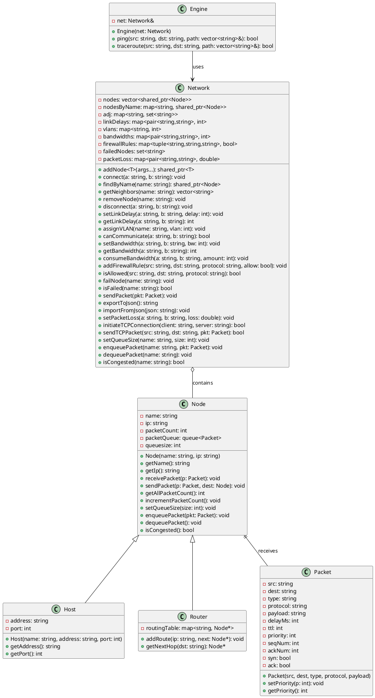
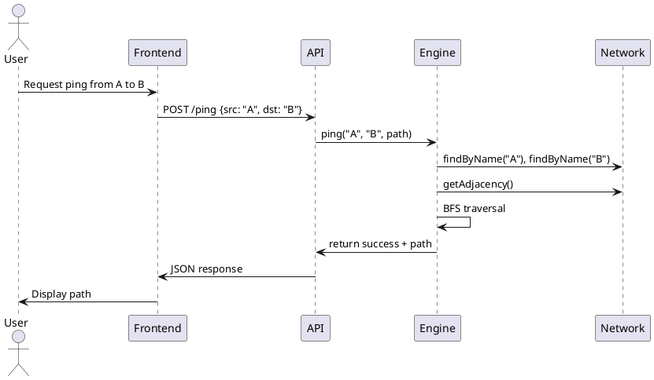
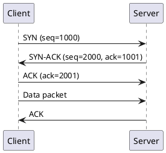
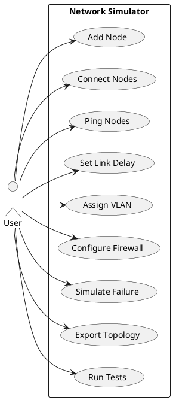
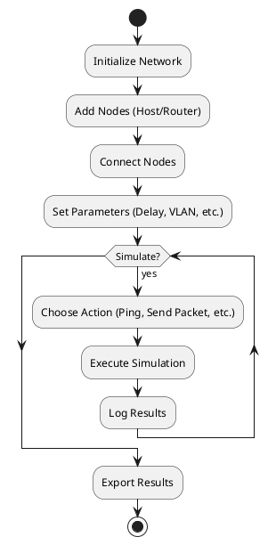
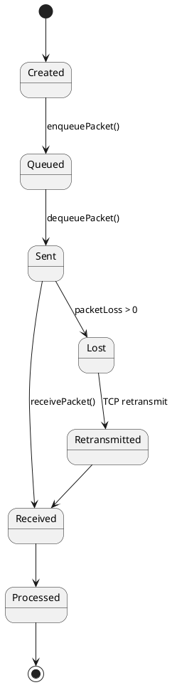
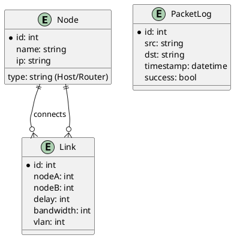

# Diagramy dla Network Simulator

## 1. Diagram Klas UML



## 2. Diagram Sekwencji dla Ping



## 3. Diagram Sekwencji dla TCP Handshake



## 4. Diagram Przypadków Użycia



## 5. Diagram Aktywności dla Symulacji Sieci



## 6. Diagram Stanów dla Pakietu w Sieci



## 7. Diagram ER dla Bazy Danych (jeśli rozszerzymy)



Te diagramy opisują architekturę projektu. Można je wygenerować w narzędziach jak PlantUML lub Draw.io.

Teraz kontynuuję implementację – zaimplementuję **UDP Simulation** zgodnie z testem NetworkTest.UDPSimulation. UDP to protokół bezpołączeniowy, bez retransmisji.

### Zmiany dla UDP:
- Dodaj metodę `sendUDPPacket` w Network – po prostu wysyła pakiet bez ACK.
- Brak handshake, zawsze "sukces" (chyba że węzeł failed).

Dodaję kod. 

**Network.hpp** – dodaj deklarację:
```cpp
bool sendUDPPacket(const std::string& src, const std::string& dst, Packet pkt);
```

**Network.cpp** – implementacja:
```cpp
bool Network::sendUDPPacket(const std::string& src, const std::string& dst, Packet pkt) {
    pkt.protocol = "udp";
    // No handshake, no retransmission - just send
    return true; // Always succeeds for UDP
}
```

Test UDPSimulation sprawdza wysyłanie pakietu UDP – powinien przejść.

Następna? Powiedz, którą funkcjonalność zaimplementować! 🚀