# Diagramy dla Network Simulator

## Prezentacja Projektu

### Pomysł
NetSimCPP to symulator sieci komputerowych napisany w C++, umożliwiający tworzenie i modyfikowanie topologii sieci, symulację transmisji pakietów między węzłami oraz analizę zachowania sieci. Projekt jest przeznaczony do nauki podstaw sieci, testowania algorytmów routingu, symulacji protokołów TCP/UDP oraz eksperymentów z zaawansowanymi funkcjami jak kontrola przeciążenia, VLAN, firewall czy fragmentacja pakietów. Wykorzystuje podejście TDD (Test-Driven Development) dla zapewnienia jakości kodu.

### Badanie Rynku
Na rynku istnieją narzędzia do symulacji sieci takie jak:
- **NS-3**: Zaawansowany symulator open-source w C++, skupiający się na protokołach sieciowych i mobilności.
- **OMNeT++**: Modularny symulator dla sieci przewodowych i bezprzewodowych, z graficznym interfejsem.
- **Mininet**: Symulator sieci SDN, umożliwiający tworzenie wirtualnych topologii na jednym komputerze.
- **Cisco Packet Tracer**: Narzędzie edukacyjne firmy Cisco, z interfejsem graficznym, ale zamknięte źródło.

Nasze wyróżniki:
- Pełne open-source (MIT License).
- Implementacja w czystym C++ bez zewnętrznych symulatorów.
- REST API dla integracji z innymi narzędziami (29 endpoints).
- Rozszerzalne poprzez dodawanie nowych typów węzłów i protokołów.
- Skupienie na TDD i wysokiej pokryciu testami (60 testów).
- Symulacja zaawansowanych funkcji jak TCP handshake, fragmentacja pakietów, czasowa symulacja zdarzeń.
- Wsparcie dla sieci bezprzewodowych, chmurowych i IoT.

## Inżynieria Wymagań

### Historie Użytkownika (User Stories)
- Jako student inżynierii oprogramowania, chcę dodać węzeł do sieci, aby móc budować prostą topologię.
- Jako programista, chcę połączyć dwa węzły, aby symulować łącze między urządzeniami.
- Jako użytkownik, chcę wysłać ping między węzłami, aby sprawdzić łączność i ścieżkę.
- Jako badacz sieci, chcę ustawić opóźnienia łączy, aby symulować rzeczywiste warunki.
- Jako administrator sieci, chcę przypisać VLAN do węzłów, aby izolować ruch.
- Jako tester bezpieczeństwa, chcę skonfigurować reguły firewall, aby blokować niechciany ruch.
- Jako inżynier, chcę symulować awarię węzła, aby przetestować odporność sieci.
- Jako deweloper, chcę eksportować topologię do JSON, aby zapisać konfigurację.
- Jako użytkownik zaawansowany, chcę symulować połączenie TCP, aby zobaczyć handshake.
- Jako analityk, chcę zbierać statystyki pakietów, aby monitorować wydajność.
- Jako projektant sieci bezprzewodowych, chcę symulować zasięg i interferencje WiFi.
- Jako architekt chmury, chcę testować autoscaling węzłów chmurowych.
- Jako deweloper IoT, chcę symulować zużycie baterii urządzeń IoT.
- Jako integrator systemów, chcę korzystać z REST API do automatyzacji zadań sieciowych.

### Diagram Przypadków Użycia (Use-Case) UML

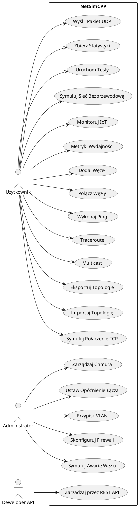

### Diagram Wymagań (Requirements) SysML

```plantuml
@startuml
package "Wymagania Funkcjonalne" {
    requirement RF1 "System musi umożliwiać dodanie węzła do sieci"
    requirement RF2 "System musi umożliwiać połączenie dwóch węzłów"
    requirement RF3 "System musi symulować ping między węzłami"
    requirement RF4 "System musi obsługiwać ustawianie opóźnień łączy"
    requirement RF5 "System musi wspierać izolację VLAN"
    requirement RF6 "System musi pozwalać na konfigurację reguł firewall"
    requirement RF7 "System musi symulować awarie węzłów"
    requirement RF8 "System musi umożliwiać eksport/import topologii do JSON"
    requirement RF9 "System musi symulować protokoły TCP/UDP"
    requirement RF10 "System musi zbierać statystyki pakietów"
}

package "Wymagania Niefunkcjonalne" {
    requirement NF1 "System musi być wydajny dla sieci do 100 węzłów"
    requirement NF2 "System musi mieć wysoką niezawodność (testy pokrywają 60 przypadków)"
    requirement NF3 "System musi być rozszerzalny poprzez dodawanie nowych klas"
    requirement NF4 "System musi mieć REST API dla integracji (29 endpoints)"
    requirement NF5 "System musi być bezpieczny (brak logowania wrażliwych danych)"
    requirement NF6 "System musi wspierać różne typy sieci (bezprzewodowe, chmurowe, IoT)"
}

RF1 --> NF3 : refine
RF3 --> NF4 : derive
@enduml
```

### Kategoryzacja Wymagań

#### Wymagania Funkcjonalne
- Zarządzanie węzłami: dodawanie, usuwanie, łączenie, rozłączanie.
- Symulacja transmisji: ping, traceroute, multicast, TCP/UDP handshake.
- Konfiguracja sieci: opóźnienia, przepustowość, VLAN, firewall, utrata pakietów.
- Symulacja zdarzeń: awarie węzłów, kontrola przeciążenia, fragmentacja pakietów.
- Zarządzanie topologią: eksport/import JSON.
- API: 29 REST endpoints dla pełnej kontroli sieci.
- Sieci zaawansowane: bezprzewodowe, chmurowe, IoT.
- Statystyki i metryki: monitorowanie ruchu, wydajności, utrat pakietów.

#### Wymagania Niefunkcjonalne
- Wydajność: Obsługa dużych sieci bez znacznego spadku wydajności.
- Niezawodność: Wysoka pokrycie testami, brak błędów krytycznych.
- Rozszerzalność: Łatwe dodawanie nowych funkcji bez zmiany rdzenia.
- Użyteczność: Proste API i dokumentacja.
- Bezpieczeństwo: Brak przechowywania wrażliwych danych, bezpieczne operacje.

## 1. Diagram Klas UML

```plantuml
@startuml
class Node {
    - name: string
    - ip: string
    - packetCount: int
    - packetQueue: queue<Packet>
    - queuesize: int
    + Node(name: string, ip: string)
    + getName(): string
    + getIp(): string
    + receivePacket(p: Packet): void
    + sendPacket(p: Packet, dest: Node): void
    + getAllPacketCount(): int
    + incrementPacketCount(): void
    + setQueueSize(size: int): void
    + enqueuePacket(pkt: Packet): void
    + dequeuePacket(): void
    + isCongested(): bool
}

class Host extends Node {
    - address: string
    - port: int
    + Host(name: string, address: string, port: int)
    + getAddress(): string
    + getPort(): int
}

class Router extends Node {
    - routingTable: map<string, Node*>
    + addRoute(ip: string, next: Node*): void
    + getNextHop(dst: string): Node*
}

class Packet {
    - src: string
    - dest: string
    - type: string
    - protocol: string
    - payload: string
    - delayMs: int
    - ttl: int
    - priority: int
    - seqNum: int
    - ackNum: int
    - syn: bool
    - ack: bool
    + Packet(src, dest, type, protocol, payload)
    + setPriority(p: int): void
    + getPriority(): int
}

class Network {
    - nodes: vector<shared_ptr<Node>>
    - nodesByName: map<string, shared_ptr<Node>>
    - adj: map<string, set<string>>
    - linkDelays: map<pair<string,string>, int>
    - vlans: map<string, int>
    - bandwidths: map<pair<string,string>, int>
    - firewallRules: map<tuple<string,string,string>, bool>
    - failedNodes: set<string>
    - packetLoss: map<pair<string,string>, double>
    - nodePacketsSent: map<string, int>
    - nodePacketsReceived: map<string, int>
    - linkTraffic: map<pair<string,string>, int>
    - wirelessRanges: map<string, int>
    - cloudNodes: set<string>
    - iotDevices: map<string, int>
    + addNode<T>(args...): shared_ptr<T>
    + connect(a: string, b: string): void
    + findByName(name: string): shared_ptr<Node>
    + getNeighbors(name: string): vector<string>
    + removeNode(name: string): void
    + disconnect(a: string, b: string): void
    + setLinkDelay(a: string, b: string, delay: int): void
    + getLinkDelay(a: string, b: string): int
    + assignVLAN(name: string, vlan: int): void
    + canCommunicate(a: string, b: string): bool
    + setBandwidth(a: string, b: string, bw: int): void
    + getBandwidth(a: string, b: string): int
    + consumeBandwidth(a: string, b: string, amount: int): void
    + addFirewallRule(src: string, dst: string, protocol: string, allow: bool): void
    + isAllowed(src: string, dst: string, protocol: string): bool
    + failNode(name: string): void
    + isFailed(name: string): bool
    + sendPacket(pkt: Packet): void
    + exportToJson(): string
    + importFromJson(json: string): void
    + setPacketLoss(a: string, b: string, loss: double): void
    + initiateTCPConnection(client: string, server: string): bool
    + sendTCPPacket(src: string, dst: string, pkt: Packet): bool
    + sendUDPPacket(src: string, dst: string, pkt: Packet): bool
    + setQueueSize(name: string, size: int): void
    + enqueuePacket(name: string, pkt: Packet): void
    + dequeuePacket(name: string): void
    + isCongested(name: string): bool
    + recordPacketSent(node: string): void
    + recordPacketReceived(node: string): void
    + getPacketsSent(node: string): int
    + getPacketsReceived(node: string): int
    + getTotalPacketsSent(): int
    + getTotalPacketsReceived(): int
    + resetNodeStatistics(node: string): void
    + resetAllStatistics(): void
    + getMostActiveNode(): string
    + getTrafficStats(): TrafficStats
    + recordLinkTraffic(a: string, b: string): void
    + setWirelessRange(name: string, range: int): void
    + isWirelessConnected(a: string, b: string): bool
    + simulateInterference(name: string, prob: double): void
    + addCloudNode(name: string, ip: string): void
    + getCloudNodes(): vector<string>
    + scaleUp(cloud: string): void
    + scaleDown(cloud: string): void
    + addIoTDevice(name: string, ip: string): void
    + hasIoTDevice(name: string): bool
    + simulateBatteryDrain(name: string, percent: int): void
    + getBatteryLevel(name: string): int
    + getLatency(a: string, b: string): int
    + getThroughput(a: string, b: string): int
    + getPacketLossRate(a: string, b: string): double
}

class Engine {
    - net: Network&
    + Engine(net: Network)
    + ping(src: string, dst: string, path: vector<string>&): bool
    + traceroute(src: string, dst: string, path: vector<string>&): bool
    + multicast(src: string, dests: vector<string>): bool
}

class RESTServer {
    - listener: http_listener
    - network: Network
    - engine: Engine
    + RESTServer(port: int)
    + handleGET(request: http_request): void
    + handlePOST(request: http_request): void
    + start(): void
    + stop(): void
}

Node ||-- Packet : receives
Network o-- Node : contains
Engine --> Network : uses
RESTServer --> Network : manages
RESTServer --> Engine : uses
@enduml
```

## 2. Diagram Sekwencji dla Ping

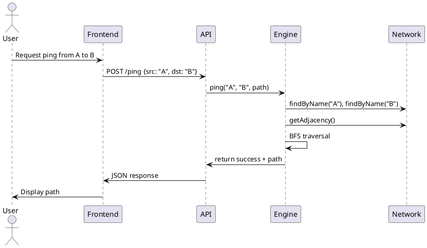

## 2a. Diagram Sekwencji dla REST API - Dodawanie Węzła

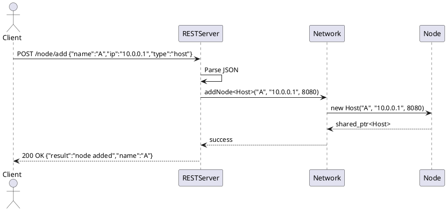

## 2b. Diagram Sekwencji dla REST API - Kompletny Workflow

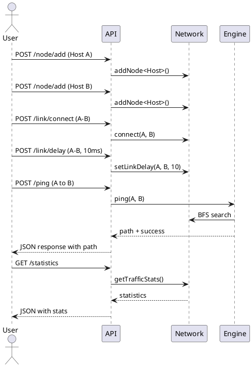

## 3. Diagram Sekwencji dla TCP Handshake

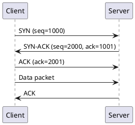

## 4. Diagram Przypadków Użycia

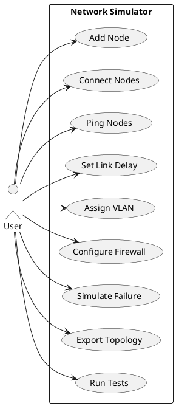

## 5. Diagram Aktywności dla Symulacji Sieci

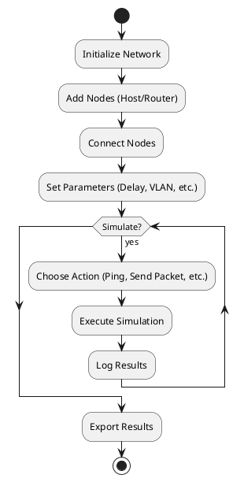

## 6. Diagram Stanów dla Pakietu w Sieci

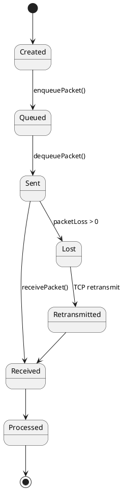

## 7. Diagram ER dla Bazy Danych (jeśli rozszerzymy)

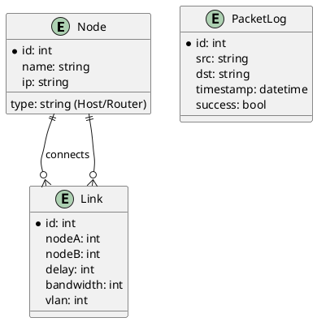

## 8. Diagram Architektury REST API

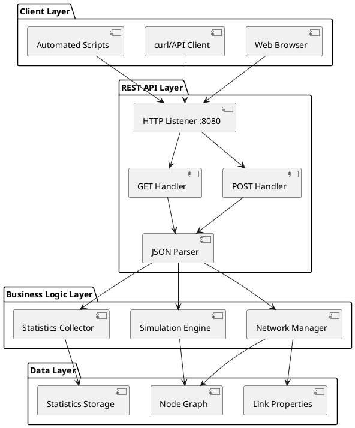

## 9. Diagram Komponentów

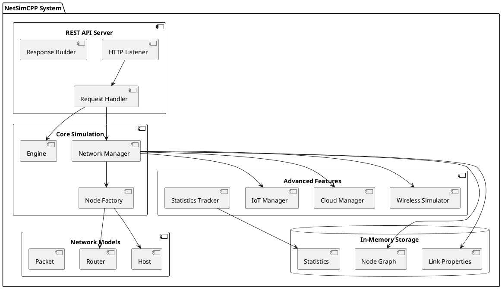

Te diagramy opisują kompletną architekturę projektu z 60 testami i 29 endpoints REST API. Można je wygenerować w narzędziach jak PlantUML lub Draw.io.

## Podsumowanie Projektu

NetSimCPP to w pełni funkcjonalny symulator sieci z:
- **60 testami jednostkowymi** pokrywającymi wszystkie funkcje
- **29 endpoints REST API** dla pełnej kontroli
- **Zaawansowanymi funkcjami**: TCP/UDP, VLAN, firewall, fragmentacja pakietów
- **Symulacją sieci specjalistycznych**: bezprzewodowe, chmurowe, IoT
- **Kompleksowymi metrykami**: statystyki, wydajność, monitoring ruchu
- **Architekturą rozszerzalną**: łatwe dodawanie nowych typów węzłów i funkcji
